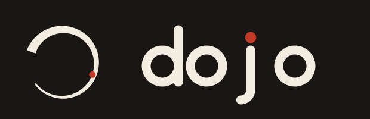

# dojo

A training ground for AI coding tools. Clone once, run one command, and
**opencode**, **Claude Code**, **GitHub Copilot CLI**, **OpenAI Codex CLI**,
**Aider**, **Google Antigravity CLI**, **OpenClaw**, and **Cursor** are all set up with
whatever token-saving optimizations each one actually supports — plus your
GitHub projects, cloned and ready.

Anyone can point this at their own GitHub and train their own setup the
same way.

## Quickstart

```bash
bash <(curl -fsSL https://raw.githubusercontent.com/Cyb3rRon1n/dojo/main/install.sh)
```

```powershell
# Windows (PowerShell)
powershell -ExecutionPolicy ByPass -c "irm https://raw.githubusercontent.com/Cyb3rRon1n/dojo/main/install.ps1 | iex"
```

Installs whichever of the eight tools you don't already have, wires up
whatever optimizations each one supports, clones `~/projects/github/repos`,
and prompts for GitHub auth (SSH key or `gh auth login`) if it's missing.
No sudo/elevation required for any of it. Safe to re-run later — every step
is a no-op if already done.

**Windows notes** (native PowerShell, not WSL):
- The `dojo` CLI itself (`dojo update`/`status`/`doctor`/`tokens`) is a bash
  script — `bootstrap.ps1` wires
  it through Git for Windows' `bash.exe` if found (near-universal, since
  it ships with Git for Windows). Everything else works without it.
- `rtk` now ships a real Windows build and installs automatically, same as
  Linux/Mac.
- Prefer WSL instead? `install.sh`/`bootstrap.sh` already run unmodified
  inside it — just run the bash Quickstart command above from your WSL
  shell instead of `install.ps1`.

## Catalog

### Tools dojo sets up

| Tool | What it is |
|---|---|
| [opencode](https://opencode.ai) | Open-source terminal coding agent |
| [Claude Code](https://www.npmjs.com/package/@anthropic-ai/claude-code) | Anthropic's terminal coding agent |
| [GitHub Copilot CLI](https://www.npmjs.com/package/@github/copilot) | GitHub's terminal coding agent |
| [OpenAI Codex CLI](https://www.npmjs.com/package/@openai/codex) | OpenAI's terminal coding agent |
| [Aider](https://aider.chat) | Open-source, git-native AI pair programmer |
| [Antigravity CLI](https://antigravity.google) | Google's terminal coding agent (replaced the retired Gemini CLI, 2026-06) |
| [OpenClaw](https://openclaw.ai) | Agent runtime with a plugin system |
| [Cursor](https://cursor.com) | AI IDE (install-only — no plugin API, so no optimizations) |
| [Cline](https://cline.bot) | Headless CLI of the Cline VS Code agent (5M+ installs) |
| [Qwen Code](https://www.npmjs.com/package/@qwen-code/qwen-code) | Alibaba's terminal agent, free Qwen OAuth tier |
| [Goose](https://block.github.io/goose) | Block's MCP-native agent, Linux-Foundation governed |
| [Pi](https://pi.dev) | Minimal coding-agent harness, any provider or local model |

dojo never force-installs a tool you didn't ask for — `bootstrap.sh` only
configures what's already present on the machine (`install.sh` is the one
that offers to install all eight fresh).

### Optimizations dojo wires up

| Plugin | What it does | Works with |
|---|---|---|
| [RTK](https://github.com/rtk-ai/rtk) | Filters command output before it hits context — up to 90% fewer tokens per command | Claude Code, opencode, Copilot CLI, Codex CLI |
| [graphify](https://www.npmjs.com/package/@javargasm/opencode-graphify) | Builds a queryable knowledge graph of the codebase, once, instead of re-reading files every question | Claude Code, opencode, Copilot CLI, Codex CLI, Aider |
| [token-optimizer](https://github.com/alexgreensh/token-optimizer) | Audits the running session for context waste and gives a quality score | Claude Code, opencode, OpenClaw |
| [ponytail](https://github.com/DietrichGebert/ponytail) | Coding-style guardrail against over-engineering — smallest correct solution, stdlib first | Claude Code, opencode, OpenClaw |
| [opencode-token-usage](https://www.npmjs.com/package/opencode-token-usage) | Live token/cost usage in the opencode session list | opencode |
| Aider's native settings | Turns on Aider's own built-in prompt caching (off by default upstream) — no plugin exists because Aider has no plugin system | Aider only |

Nothing here is faked: token-optimizer and ponytail simply don't have a
Copilot CLI / Codex CLI / Aider build yet, so dojo doesn't claim one. What
those tools *do* support natively — a token/context readout in the TUI footer
(Codex `status_line`, Copilot CLI experimental `STATUS_LINE` statusline, and
Claude Code's statusLine slot, auto-filled by token-optimizer) — is wired up
too. Cursor has no plugin API or statusline, so it's install-only, honestly
noted.

### Claude Code-only additions

Not token/context optimizations, so kept out of the table above — a coding
methodology library and a meta-skill for growing your own skill set:

| Plugin | What it does |
|---|---|
| [superpowers](https://github.com/obra/superpowers) | Skills library for TDD, systematic debugging, and collaboration patterns |
| [task-observer](https://github.com/rebelytics/one-skill-to-rule-them-all) | Watches sessions for corrections/gaps and logs skill-improvement candidates for review — vendored under `claude/skills/task-observer/` (see that dir's `UPSTREAM.md`), since upstream ships as a plain skill bundle with no plugin-marketplace manifest |

## Commands

Once installed, a `dojo` command is on your `PATH`:

```bash
dojo status   # versions, GitHub auth, whether you're behind origin
dojo doctor   # verify every wiring point (PATH, symlinks, hooks, plugins); exit 1 if broken
dojo update   # git pull + re-run bootstrap.sh, from wherever you cloned it
dojo install  # re-run install.sh (idempotent) — same one-shot as a fresh machine
dojo tokens   # live token usage / cache refresh / context-fill thresholds
```

`dojo update` is the self-heal: any wiring that rotted (deleted symlink, lost
plugin, missing hook) is re-created. `dojo doctor` tells you *when* to run it.

### Token status

While opencode or Claude Code is running, token-optimizer writes live session
state (per-session SQLite + a global trends DB) under
`~/.local/share/token-optimizer/`; Claude Code also keeps JSON state under
`~/.claude/token-optimizer/`. `dojo tokens` reads all of it (the env var
`TOKEN_OPTIMIZER_DATA_DIR`, if set, overrides the data directory) and
prints current **token usage** (input/output), **token refresh** (context-cache
read/write), and **context-fill threshold** percentage vs the model's context
window, colored by the same Good/Fair/Needs-Work/Poor bands the plugin itself
uses. `dojo tokens --one-line` emits the same readout as one compact colored line.

### Persistence

The toolchain PATH is written into your shell profile (`~/.bashrc`, plus
`~/.zshrc` if present) as a marked, dojo-managed block — so `opencode`,
`claude`, `rtk`, `graphify`, and `nvm` are on `PATH` after a fresh login. The
block is rewritten from the installed dojo version on every `dojo update`;
don't hand-edit it. The same block also sources a shared ssh-agent helper
(`ssh-agent.sh`, linked to `~/.local/bin/dojo-ssh-agent.sh`), so every shell —
and tools launched from them — see your GitHub key through one stable agent
socket. (Windows instead uses the built-in ssh-agent service, configured by
`bootstrap.ps1`.)

<details>
<summary><b>Prefer manual setup?</b></summary>

Same result, step by step — install only the tools you want:

```bash
curl -fsSL https://opencode.ai/install | bash
npm install -g @anthropic-ai/claude-code
npm install -g @github/copilot
npm install -g @openai/codex
curl -fsSL https://aider.chat/install.sh | sh
curl -fsSL https://antigravity.google/cli/install.sh | bash
curl -fsSL --proto '=https' --tlsv1.2 https://openclaw.ai/install.sh | bash -s -- --no-onboard
curl https://cursor.com/install -fsSL | bash
curl -LsSf https://astral.sh/uv/install.sh | sh
git clone git@github.com:Cyb3rRon1n/dojo.git ~/dojo
~/dojo/bootstrap.sh
```

`bootstrap.sh` detects what's present and skips the rest. It also finds its
own location, so `~/dojo` isn't required — cloning dojo alongside your
other repos (e.g. `~/projects/github/repos/dojo`) works identically.

</details>

<details>
<summary><b>Reference</b></summary>

Only the opencode side is version-pinned, in `opencode/opencode.jsonc` /
`opencode/package.json` — bump deliberately. Every other install path
(Claude Code's plugin marketplace, RTK's and graphify's own install
scripts, Aider's installer) always fetches latest, so don't expect versions
to match across tools.

| Component | opencode version (pinned) |
|---|---|
| RTK | 0.1.5 |
| token-optimizer | 1.1.0 |
| ponytail (`@dietrichgebert/ponytail`) | 4.9.0 |
| graphify | 0.2.0 |
| opencode-token-usage | 1.0.0 |

Files this repo does **not** touch on your machine:
- `~/.claude/settings.json` — hooks/settings stay machine-local. Only the
  RTK `PreToolUse` hook is added, via `rtk init -g`, and the statusLine slot
  is left empty (token-optimizer auto-fills it).
- `~/.config/opencode/package-lock.json` — regenerated by `npm install`.

Copilot CLI / Codex CLI config is owned by those tools: dojo only appends a
statusline when one isn't already configured (`~/.copilot/settings.json`,
`~/.codex/config.toml`) and never clobbers a user-managed one.

</details>

<details>
<summary><b>Layout</b></summary>

```
opencode/
  opencode.jsonc     # pinned plugin list (symlinked into ~/.config/opencode/)
  package.json       # pinned npm deps (copied; npm install fills node_modules)
  package-lock.json
  plugins/
    token-gauge.js   # local fallback plugin, linked when npm can't install the pinned ones
claude/
  CLAUDE.md          # user instructions (symlinked into ~/.claude/)
  RTK.md             # RTK reference (symlinked into ~/.claude/)
aider/
  aider.conf.yml     # default Aider settings (symlinked to ~/.aider.conf.yml)
copilot/
  statusline.sh      # Copilot CLI footer readout (linked into ~/.copilot/)
  statusline.ps1     # same, native Windows port (no python3 dependency)
tests/
  test_dojo.bats     # bats suite (SQLite/JSON fixtures, idempotence, pins)
.github/workflows/
  ci.yml             # py_compile + bats + shellcheck on main/PR
assets/               # dojo's own logo/banner (mark, lockup, social preview)
bootstrap.sh          # idempotent setup (plugins, hooks, configs, per tool)
bootstrap.ps1         # same, native Windows port (PowerShell, run by install.ps1)
install.sh            # one-shot fresh-machine build-out (installs all 8 tools, calls bootstrap.sh, then clones repos/)
install.ps1           # same, native Windows port -- installs via npm/winget/official *.ps1 installers, calls bootstrap.ps1
dojo                  # day-to-day command: `dojo update` / `dojo install` / `dojo status` / `dojo doctor` / `dojo tokens` (symlinked onto PATH by bootstrap.sh; shimmed via git-bash on Windows)
dojo-tokens.py        # reads token-optimizer's live state (SQLite + Claude JSON) — used by `dojo tokens`
ssh-agent.sh          # shared ssh-agent helper, sourced by the profile block (linked to ~/.local/bin/dojo-ssh-agent.sh)
```

</details>
